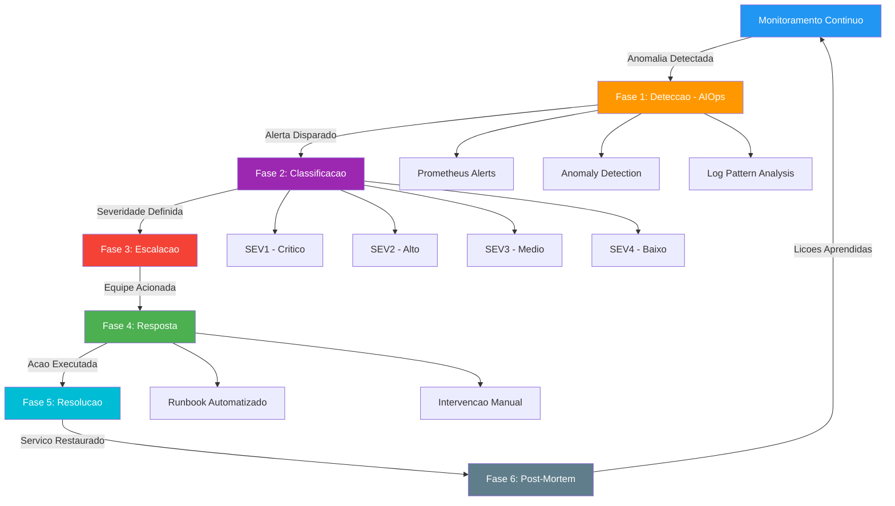

# ITSM - Ciclo de Vida de Gestao de Incidentes

## SolidaryTech - Processo de Gestao de Incidentes com AIOps

---

## 1. Visao Geral

A SolidaryTech adota um processo de gestao de incidentes baseado em ITIL v4, integrado com praticas de AIOps para deteccao preditiva e automacao de respostas. O objetivo e transicionar de um modelo **reativo** (usuario reporta problema) para um modelo **preditivo** (sistema detecta e age antes do impacto).

---

## 2. Fluxo do Ciclo de Vida do Incidente



---

## 3. Fases Detalhadas

### Fase 1: Deteccao (AIOps)

O pilar da deteccao preditiva na SolidaryTech combina tres camadas:

**Camada 1 - Alertas Baseados em Regras (Prometheus)**
- Alertas de SLO burn rate (consumo do Error Budget)
- Alertas de Golden Metrics (latencia, erros, throughput, saturacao)
- Alertas de infraestrutura (CPU > 80%, memoria > 85%, disco > 90%)

**Camada 2 - Deteccao de Anomalias (Grafana ML)**
- Analise de series temporais para identificar desvios do baseline
- Deteccao de padroes sazonais (picos de doacoes em datas comemorativas)
- Correlacao automatica entre metricas de diferentes servicos

**Camada 3 - Analise de Logs (Loki + AlertManager)**
- Padroes de log de erro acima do threshold
- Deteccao de stack traces recorrentes
- Correlacao de logs entre microsservicos via trace ID

| Fonte | Ferramenta | Tipo de Deteccao | Tempo de Deteccao |
|-------|------------|------------------|-------------------|
| Metricas | Prometheus + Grafana | Threshold + Anomalia | < 1 minuto |
| Logs | Loki + AlertManager | Pattern matching | < 2 minutos |
| Traces | OpenTelemetry + Grafana | Latencia anormal | < 1 minuto |
| Sintetico | Blackbox Exporter | Health check falho | < 30 segundos |

### Fase 2: Classificacao

Ao receber um alerta, o sistema classifica automaticamente o incidente com base em regras pre-definidas:

| Severidade | Descricao | Tempo de Resposta | Exemplo |
|------------|-----------|-------------------|---------|
| **SEV1 - Critico** | Servico critico indisponivel ou perda de dados | < 5 minutos | donation-service fora do ar |
| **SEV2 - Alto** | Degradacao significativa de performance | < 15 minutos | Latencia p99 > 2s no donation-service |
| **SEV3 - Medio** | Funcionalidade parcialmente afetada | < 1 hora | ngo-service com erros intermitentes |
| **SEV4 - Baixo** | Problema cosmético ou nao urgente | < 4 horas | Dashboard de monitoramento com atraso |

**Classificacao Automatica:**
```yaml
# Regra de classificacao no AlertManager
route:
  receiver: 'default'
  routes:
    - match:
        severity: critical
      receiver: 'pagerduty-critical'
      group_wait: 10s
      repeat_interval: 5m
    - match:
        severity: warning
      receiver: 'slack-warnings'
      group_wait: 30s
      repeat_interval: 15m
```

### Fase 3: Escalacao

**Matriz de Escalacao:**

| Nivel | Quem | Quando | Canal |
|-------|------|--------|-------|
| **L1** | SRE On-Call | Imediatamente | PagerDuty + Slack |
| **L2** | SRE Senior + Dev Owner | Apos 15 min sem resolucao | PagerDuty + Slack + Bridge Call |
| **L3** | Incident Commander + Gerencia | Apos 30 min ou SEV1 | Bridge Call + Email executivo |
| **L4** | CTO + Suporte AWS | Apos 1h ou impacto em dados | Telefone + AWS Support Case |

**Rotacao On-Call:**
- Escala semanal de on-call com 2 engenheiros (primario e backup)
- Handoff formalizado toda segunda-feira as 09:00 UTC
- Compensacao: dia de folga apos semana de on-call

### Fase 4: Resposta

A resposta segue um Runbook estruturado. Cada alerta possui um runbook associado.

**Exemplo de Runbook: donation-service com alta taxa de erros**

| Passo | Acao | Comando/Link |
|-------|------|--------------|
| 1 | Verificar dashboard SRE | Grafana: SRE Golden Metrics Dashboard |
| 2 | Verificar traces com erro | Grafana: Explore > Traces > donation-service |
| 3 | Verificar logs do servico | `kubectl logs -l app=donation-service --tail=100` |
| 4 | Verificar metricas do RDS | CloudWatch: RDS Metrics |
| 5 | Verificar fila SQS | AWS Console: SQS > donation-queue |
| 6 | Se bug no codigo: rollback | `git revert <commit> && git push` (ArgoCD faz o deploy) |
| 7 | Se problema de infra: escalar | `kubectl scale deployment donation-service --replicas=5` |
| 8 | Se problema no banco: failover | Executar runbook de failover RDS |

**Comunicacao durante a Resposta:**
- Canal dedicado: `#inc-YYYYMMDD-descricao` no Slack
- Status page atualizado a cada 15 minutos (SEV1) ou 30 minutos (SEV2)
- Scribe designado para documentar timeline

### Fase 5: Resolucao

| Atividade | Descricao |
|-----------|-----------|
| **Confirmar resolucao** | Metricas voltaram ao baseline, SLOs dentro do target |
| **Validar com smoke tests** | Executar suite de testes de integracao basica |
| **Comunicar resolucao** | Atualizar status page e notificar stakeholders |
| **Remover workarounds** | Se houve escalonamento manual, reverter para configuracao padrao |
| **Fechar incidente** | Atualizar status para "Resolvido" no sistema de tracking |

### Fase 6: Post-Mortem (Blameless)

**Prazo:** Post-Mortem deve ser conduzido dentro de 48 horas apos a resolucao do incidente.

**Template de Post-Mortem:**

```markdown
# Post-Mortem: [Titulo do Incidente]

**Data do Incidente:** YYYY-MM-DD
**Duracao:** X horas Y minutos
**Severidade:** SEV[1-4]
**Incident Commander:** [Nome]
**Servicos Afetados:** [Lista]

## Resumo Executivo
[2-3 frases descrevendo o que aconteceu e o impacto]

## Impacto
- Usuarios afetados: [numero]
- Doacoes nao processadas: [numero/valor]
- Duracao do impacto: [tempo]
- SLO impactado: [qual SLO e quanto do Error Budget foi consumido]

## Timeline
| Hora (UTC) | Evento |
|------------|--------|
| HH:MM | Primeiro alerta disparado |
| HH:MM | On-call acionado |
| HH:MM | Causa raiz identificada |
| HH:MM | Fix aplicado |
| HH:MM | Servico restaurado |
| HH:MM | Incidente encerrado |

## Causa Raiz
[Descricao tecnica da causa raiz, sem culpar individuos]

## O que Funcionou Bem
- [Item 1]
- [Item 2]

## O que Pode Melhorar
- [Item 1]
- [Item 2]

## Action Items
| # | Acao | Responsavel | Prazo | Prioridade |
|---|------|-------------|-------|------------|
| 1 | [Acao preventiva] | [Nome] | [Data] | P[0-3] |
| 2 | [Melhoria no monitoramento] | [Nome] | [Data] | P[0-3] |
| 3 | [Atualizacao de runbook] | [Nome] | [Data] | P[0-3] |

## Licoes Aprendidas
[Reflexoes para evitar recorrencia - foco em processo, nao em pessoas]
```

---

## 4. Integracao AIOps

### Arquitetura de AIOps na SolidaryTech

```
┌─────────────────────────────────────────────────────────────────┐
│                        CAMADA DE COLETA                        │
│  ┌──────────┐  ┌───────────┐  ┌────────────┐  ┌────────────┐  │
│  │Prometheus│  │   Loki    │  │  OTel      │  │  Blackbox  │  │
│  │(Metricas)│  │  (Logs)   │  │(Traces)    │  │ (Sintetico)│  │
│  └────┬─────┘  └─────┬─────┘  └─────┬──────┘  └─────┬──────┘  │
└───────┼──────────────┼──────────────┼──────────────┼───────────┘
        │              │              │              │
┌───────▼──────────────▼──────────────▼──────────────▼───────────┐
│                     CAMADA DE ANALISE                          │
│  ┌──────────────────────────────────────────────────────────┐  │
│  │               Grafana (Correlacao e ML)                  │  │
│  │  - Anomaly Detection em series temporais                │  │
│  │  - Correlacao automatica entre metricas, logs e traces  │  │
│  │  - Baseline learning (padroes normais vs anomalos)      │  │
│  └──────────────────────┬───────────────────────────────────┘  │
└─────────────────────────┼─────────────────────────────────────┘
                          │
┌─────────────────────────▼─────────────────────────────────────┐
│                      CAMADA DE ACAO                           │
│  ┌──────────────┐  ┌──────────────┐  ┌─────────────────────┐  │
│  │ AlertManager │  │   PagerDuty  │  │ Automacao (Scripts) │  │
│  │ (Roteamento) │  │ (Escalacao)  │  │ (Auto-remediation)  │  │
│  └──────────────┘  └──────────────┘  └─────────────────────┘  │
└───────────────────────────────────────────────────────────────┘
```

### Capacidades de AIOps Implementadas

| Capacidade | Ferramenta | Descricao |
|------------|------------|-----------|
| **Anomaly Detection** | Grafana ML | Detecta desvios automaticamente no baseline de metricas |
| **Correlacao de Eventos** | Grafana + Loki | Correlaciona alertas de metricas com padroes de logs |
| **Distributed Tracing** | OpenTelemetry | Rastreia requisicoes end-to-end entre microsservicos |
| **Noise Reduction** | AlertManager Grouping | Agrupa alertas relacionados para evitar alert fatigue |
| **Predictive Alerting** | Prometheus predict_linear | Preve esgotamento de recursos (disco, memoria) |
| **Auto-Remediation** | SelfHealing Handler + HPA + AIOps CronJob | Webhook Python + CronJob (8 verificacoes a cada 5 min): CrashLoopBackOff, capacidade, monitoring, ArgoCD, services, health, AWS, namespaces |
| **Auto-Scaling (Pod)** | HPA (CPU + Memoria) | donation-service max 4, ngo/volunteer max 3 (limitado por capacidade t3.medium: 17 pods/node) |
| **Auto-Scaling (Node)** | node-autoscaler.sh (workaround Academy) | Escala nodes de 1 a 3 via API EKS (Cluster Autoscaler inoperante por restricao IAM) |
| **Auto-DR Failover** | dr-health-checker.sh | Monitora producao, failover automatico apos 3 falhas consecutivas |

### Exemplo: Deteccao Preditiva com predict_linear

```yaml
# Alerta preditivo: preve disco cheio em 4 horas
- alert: DiskSpacePrediction
  expr: predict_linear(node_filesystem_avail_bytes[6h], 4*3600) < 0
  for: 10m
  labels:
    severity: warning
  annotations:
    summary: "Disco previsto para encher em 4 horas"
    description: "Baseado na tendencia das ultimas 6h, o disco estara cheio em aproximadamente 4h."
```

---

## 5. Metricas de Performance do Processo ITSM

| KPI | Meta | Medicao |
|-----|------|---------|
| **MTTD** (Mean Time to Detect) | < 2 minutos | Tempo entre inicio do problema e primeiro alerta |
| **MTTA** (Mean Time to Acknowledge) | < 5 minutos | Tempo entre alerta e primeiro humano respondendo |
| **MTTR** (Mean Time to Recovery) | < 30 minutos (SEV1) | Tempo entre inicio do problema e resolucao |
| **MTBF** (Mean Time Between Failures) | > 30 dias | Tempo medio entre incidentes SEV1/SEV2 |
| **Incidentes/mes** | < 5 (SEV1+SEV2) | Total de incidentes de alta severidade |
| **Post-Mortems completos** | 100% para SEV1/SEV2 | Taxa de conclusao de post-mortems |
| **Action Items concluidos** | > 80% em 30 dias | Taxa de conclusao de acoes corretivas |

---

## 6. Auto-Scaling e Failover Automatico

### Escalabilidade em 3 Camadas

A SolidaryTech implementa escalabilidade automatica em 3 camadas independentes, garantindo que picos de trafego sejam absorvidos sem intervencao humana:

**Camada 1 — Pod Auto-Scaling (HPA)**

```
Carga aumenta -> CPU/Memoria sobe -> HPA detecta (via Metrics Server)
    -> Cria novos pods (ate maxReplicas)
    -> donation-service: max 4 replicas (Hot Path, maior headroom)
```

| Servico | Min | Max | CPU Target | Memoria Target | Scale-Up |
|---------|-----|-----|------------|----------------|----------|
| donation-service (Hot Path) | 1 | 4 | 60% | 75% | 4 pods/30s (stab 300s) |
| donation-worker | 1 | 4 | 70% | 80% | padrao (escalado a 0 no Academy) |
| ngo-service | 1 | 3 | 70% | 80% | 2 pods/60s (stab 180s) |
| volunteer-service | 1 | 3 | 70% | 80% | 2 pods/60s (stab 180s) |

**Racional dos maxReplicas:** t3.medium suporta 17 pods por node (limitacao ENI/VPC CNI). Com 2 nodes = 34 slots. Pods fixos do sistema (kube-system ~7, ArgoCD ~7, monitoring ~10) consomem ~24 slots, restando ~10 para aplicacoes. Pior caso: 4+3+3+0 = 10 pods de app + 24 fixos = 34, no limite exato. Os maxReplicas foram calibrados para nunca exceder a capacidade fisica dos nodes.|

**Camada 1.5 — AIOps Proativa (CronJob)**

```
CronJob aiops-remediation (a cada 5 min) -> 8 verificacoes automaticas
    -> Detecta e corrige: CrashLoopBackOff, capacidade, monitoring down,
       ArgoCD degradado, services sem endpoints, health check falho,
       AWS resources, namespaces travados
```

| Verificacao | Deteccao | Correcao Automatica |
|-------------|----------|---------------------|
| CrashLoopBackOff | Pod em loop de restart | `rollout restart` do deployment |
| Capacidade de pods | Pods Pending por limite de nodes | Reduz HPA de servicos nao-criticos |
| Monitoring down | Prometheus/Grafana/Loki nao pronto | Restart + criacao de ConfigMaps Grafana |
| ArgoCD degradado | App health = Degraded | Alerta (intervencao manual) |
| Services sem endpoints | Service sem pods ativos | Alerta (verificar deployment) |
| Health check falho | `/health` nao retorna "healthy" | `rollout restart` do servico |
| AWS resources | RDS parado | `start-db-instance` automatico |
| Namespaces travados | Namespace em Terminating | Remove finalizers para destravar |

Script: `scripts/aiops-remediation.sh` (modos: normal, `--dry-run`, `--watch`)
CronJob: `kubernetes/monitoring/selfhealing/cronjob-aiops.yaml`

**Camada 2 — Node Auto-Scaling (node-autoscaler.sh)**

```
Pods Pending (sem recursos nos nodes) -> node-autoscaler.sh detecta
    -> Solicita novo node via API EKS -> Node provisionado em ~3-5 min
    -> IMDS hop limit corrigido automaticamente -> Pods agendados
```

- Metrics Server v0.7.2 fornece metricas de CPU/memoria ao HPA
- node-autoscaler.sh escala nodes de 1 a 3 via `eks:UpdateNodegroupConfig` (workaround para Cluster Autoscaler inoperante no Academy — `LabEksNodeRole` sem `autoscaling:DescribeAutoScalingGroups`)
- Scale-down apos 2 min de ociosidade com cooldown
- Em producao real: Cluster Autoscaler v1.32.0 opera nativamente via API ASG

**Camada 3 — DR Automatico (Health Checker)**

```
dr-health-checker.sh --daemon --auto-failover
    |
    [a cada 60s]
    ├── Check: EKS cluster ACTIVE?
    ├── Check: Nodes Ready > 0?
    └── Check: RDS primary available?
         |
    3 falhas consecutivas (~3 min)
         |
    FAILOVER AUTOMATICO (~2 min):
         ├── Promover RDS Read Replica
         ├── Atualizar kubeconfig + secrets
         ├── Rollout restart pods
         └── Escalar nodes DR
         |
    RTO target: ~5 minutos (teste em lab: 58s)
```

### Comandos de Operacao

```bash
# Teste de DR (sem failover real)
./scripts/dr-health-checker.sh --once --dry-run

# Monitoramento continuo com failover automatico
./scripts/dr-health-checker.sh --daemon --auto-failover

# Failover manual com sync de dados (RTO target: 3-5 min)
./scripts/dr-failover.sh

# Sync bidirecional de dados (prod↔DR)
./scripts/dr-data-sync.sh bidirectional

# Failback transparente (zero downtime para o cliente)
./scripts/dr-failback.sh

# Verificar regiao ativa
curl http://localhost:8081/region
```

### Identificacao de Regiao durante Incidente

Durante um incidente, a primeira pergunta e "em qual regiao estamos?". Tres metodos:

| Metodo | Comando/Acao |
|--------|-------------|
| Grafana | Panel "Regiao Ativa" no topo de todos os 6 dashboards (PROD=verde, DR=laranja) |
| API | `curl http://<service>/region` → retorna regiao e role (production/dr) |
| Prometheus | `count by (topology_kubernetes_io_region) (up{namespace="solidarytech"} == 1)` |

### Impacto Honesto do Failover

| Metrica | Valor |
|---------|-------|
| RTO target | 3-5 minutos (teste em lab: 58 segundos) |
| Transacoes perdidas (in-flight + tentadas) | ~4 transacoes |
| Impacto financeiro | ~R$ 7.100 por evento |
| Dados commitados | **Zero perda** (sync bidirecional) |
| Failback | **Zero downtime** (dual-active transitorio) |
